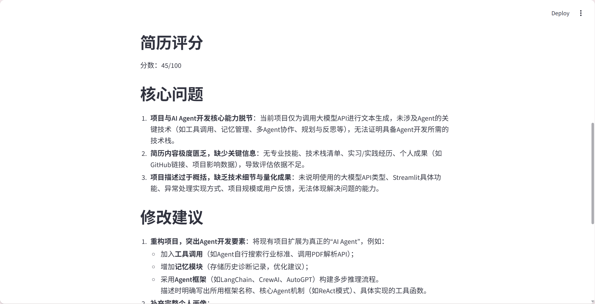

# AI Agent 简历诊断

一个基于 Streamlit 的简历诊断小工具

## 功能

- 输出目标岗位
- 粘贴简历文本
- 根据关键词进行评分
- 输出针对性的优化建议

## 项目亮点

- 使用 Streamlit 构建交互式 Web 页面
- 接入兼容 OpenAI SDK 的大模型 API
- 支持根据目标岗位进行简历诊断
- 对 API Key 缺失和调用失败进行异常处理
- 输出评分、核心问题和修改建议，便于用户快速优化简历

## 运行截图



## 简历写法
、
AI 简历诊断 Agent｜Python / Streamlit / LLM API

- 基于 Streamlit 构建交互式简历诊断页面，支持目标岗位输入和简历文本分析
- 接入兼容 OpenAI SDK 的大模型 API，实现简历评分、核心问题识别和修改建议生成
- 设计 API Key 缺失检测与异常处理逻辑，提升应用稳定性和可用性

## 面试介绍

这是一个面向 AI Agent / 大模型应用开发实习岗位的简历诊断 Agent。我使用 Streamlit 构建 Web 交互界面，接入兼容 OpenAI SDK 的大模型 API，根据用户输入的目标岗位和简历内容，生成简历评分、核心问题和修改建议。同时我加入了 API Key 检测、异常处理和样例简历读取，保证项目可以稳定演示。

## 运行方法

```bash
pip install -r requirements.txt
streamlit run app.py
```

## 后续计划

- 支持 PDF / DOCX 简历文件上传与解析
- 引入岗位知识库检索，提升诊断建议的针对性
- 增加多轮对话能力，支持用户根据建议继续修改简历
- 增加历史诊断记录，便于对比不同版本简历

